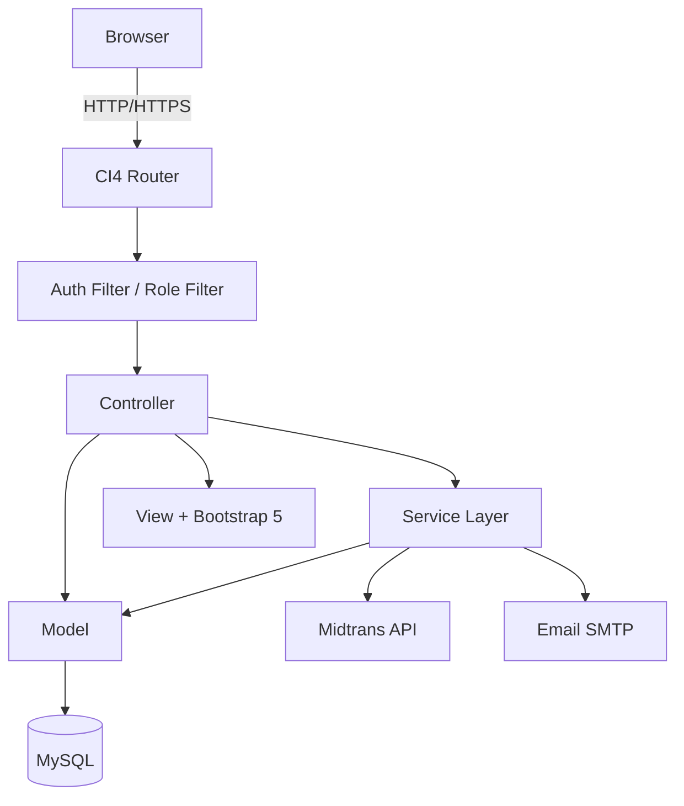
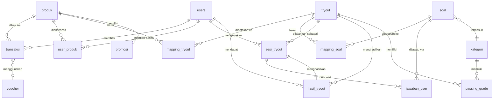
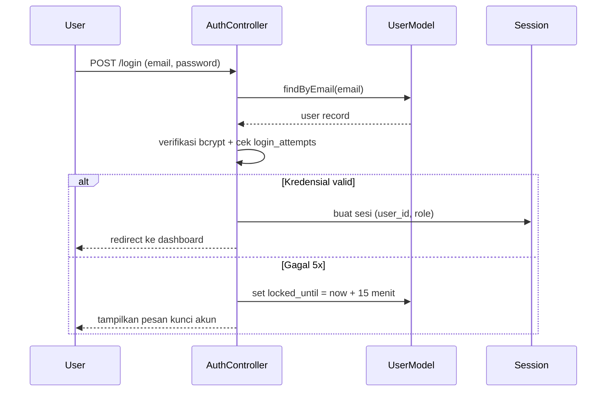
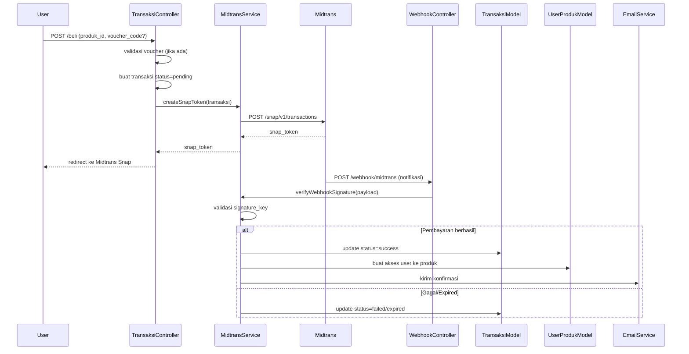
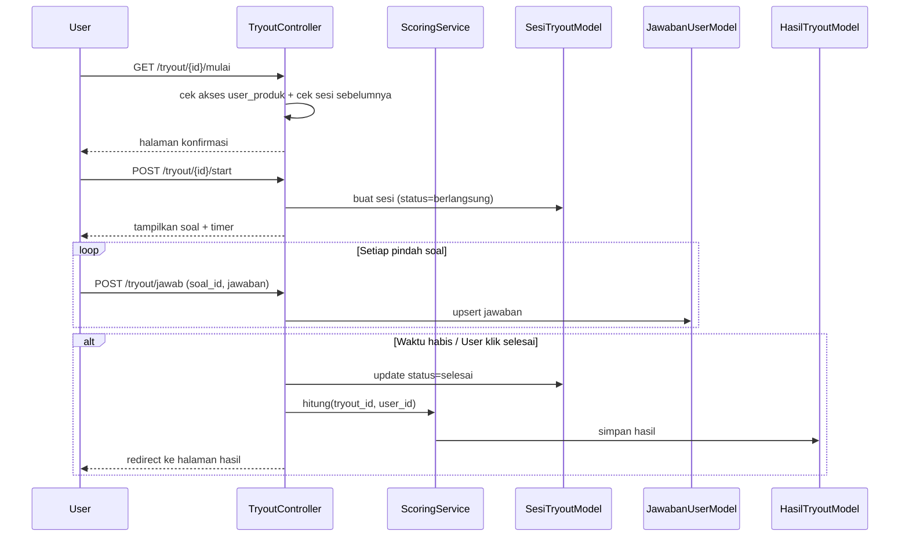

# Design Document: CPNS Tryout Online

## Overview

Aplikasi web tryout online CPNS dibangun menggunakan arsitektur MVC berbasis PHP CodeIgniter 4 dengan frontend Bootstrap 5. Sistem mendukung tiga role pengguna (User, Admin, Super_Admin) dengan alur utama: registrasi/login → pembelian produk via Midtrans → pengerjaan tryout → melihat hasil dan pembahasan.

Relasi inti antar entitas:
- **Soal** → dikaitkan ke **Tryout** melalui **Mapping_Soal**
- **Tryout** → dikaitkan ke **Produk** melalui **Mapping_Tryout**
- **Produk** → dibeli melalui **Transaksi** → dimiliki oleh **User**

---

## Architecture

### Pola Arsitektur

Sistem menggunakan pola **MVC (Model-View-Controller)** bawaan CodeIgniter 4 dengan tambahan layer **Service** untuk logika bisnis kompleks (pembayaran, kalkulasi skor).



### Struktur Direktori Proyek

```
app/
├── Config/
│   ├── Routes.php
│   ├── Filters.php
│   └── App.php
├── Controllers/
│   ├── Auth/
│   │   └── AuthController.php
│   ├── User/
│   │   ├── DashboardController.php
│   │   ├── ProdukController.php
│   │   ├── TransaksiController.php
│   │   └── TryoutController.php
│   ├── Admin/
│   │   ├── DashboardController.php
│   │   ├── Master/
│   │   │   ├── UserController.php
│   │   │   ├── KategoriController.php
│   │   │   ├── SoalController.php
│   │   │   ├── TryoutController.php
│   │   │   ├── ProdukController.php
│   │   │   ├── PassingGradeController.php
│   │   │   └── DataFileController.php
│   │   ├── Mapping/
│   │   │   ├── MappingSoalController.php
│   │   │   └── MappingTryoutController.php
│   │   ├── PromosiController.php
│   │   ├── VoucherController.php
│   │   ├── LaporanController.php
│   │   └── MenuMappingController.php
│   └── SuperAdmin/
│       ├── MasterAplikasiController.php
│       └── AuditLogController.php
├── Models/
│   ├── UserModel.php
│   ├── KategoriModel.php
│   ├── SoalModel.php
│   ├── TryoutModel.php
│   ├── ProdukModel.php
│   ├── TransaksiModel.php
│   ├── MappingSoalModel.php
│   ├── MappingTryoutModel.php
│   ├── HasilTryoutModel.php
│   ├── JawabanUserModel.php
│   ├── VoucherModel.php
│   ├── PromosiModel.php
│   ├── PassingGradeModel.php
│   ├── MenuMappingModel.php
│   ├── MasterAplikasiModel.php
│   └── AuditLogModel.php
├── Services/
│   ├── MidtransService.php
│   ├── TryoutScoringService.php
│   ├── EmailService.php
│   └── VoucherService.php
├── Filters/
│   ├── AuthFilter.php
│   └── RoleFilter.php
└── Views/
    ├── layouts/
    │   ├── main.php
    │   ├── admin.php
    │   └── auth.php
    ├── auth/
    ├── user/
    ├── admin/
    └── superadmin/
```

---

## Components and Interfaces

### Auth Filter & Role Filter

`AuthFilter` memeriksa keberadaan sesi aktif. Jika tidak ada, redirect ke `/login`. `RoleFilter` memeriksa role pengguna terhadap route yang diakses; jika tidak sesuai, tampilkan halaman 403.

```php
// app/Config/Filters.php
'aliases' => [
    'auth'       => AuthFilter::class,
    'role:admin' => RoleFilter::class,
]
```

### MidtransService

Menangani seluruh interaksi dengan Midtrans: membuat Snap token, memverifikasi signature webhook, dan memperbarui status transaksi.

```php
class MidtransService {
    public function createSnapToken(Transaksi $transaksi): string;
    public function verifyWebhookSignature(array $payload): bool;
    public function handleNotification(array $payload): void;
}
```

### TryoutScoringService

Menghitung skor, nilai per kategori, dan peringkat setelah sesi tryout selesai.

```php
class TryoutScoringService {
    public function hitung(int $tryoutId, int $userId): HasilTryout;
    public function getRanking(int $tryoutId, int $userId): int;
}
```

### Komponen UI Utama (Bootstrap 5)

| Halaman | Komponen Utama |
|---|---|
| Login / Register | Card form, alert validasi |
| Dashboard User | Stats card, tabel riwayat tryout |
| Katalog Produk | Card grid, badge harga, tombol beli |
| Halaman Tryout | Timer countdown, navigasi soal, radio button |
| Hasil Tryout | Progress bar per kategori, tabel jawaban |
| Dashboard Admin | Chart.js grafik tren, DataTables |
| Master Data | DataTables CRUD, modal form |
| Mapping Soal/Tryout | Dual-list atau drag-and-drop order |

---

## Data Models

### Skema Database (MySQL)

#### Tabel `users`
```sql
CREATE TABLE users (
    id          INT UNSIGNED AUTO_INCREMENT PRIMARY KEY,
    nama        VARCHAR(100) NOT NULL,
    email       VARCHAR(100) NOT NULL UNIQUE,
    telepon     VARCHAR(20),
    password    VARCHAR(255) NOT NULL,          -- bcrypt
    role        ENUM('user','admin','super_admin') DEFAULT 'user',
    is_active   TINYINT(1) DEFAULT 1,
    email_verified_at DATETIME NULL,
    login_attempts INT DEFAULT 0,
    locked_until DATETIME NULL,
    created_at  DATETIME,
    updated_at  DATETIME
);
```

#### Tabel `kategori`
```sql
CREATE TABLE kategori (
    id          INT UNSIGNED AUTO_INCREMENT PRIMARY KEY,
    nama        VARCHAR(100) NOT NULL,
    parent_id   INT UNSIGNED NULL,              -- sub-kategori
    created_at  DATETIME,
    updated_at  DATETIME,
    FOREIGN KEY (parent_id) REFERENCES kategori(id)
);
```

#### Tabel `soal`
```sql
CREATE TABLE soal (
    id          INT UNSIGNED AUTO_INCREMENT PRIMARY KEY,
    kategori_id INT UNSIGNED NOT NULL,
    pertanyaan  TEXT NOT NULL,
    pilihan_a   TEXT NOT NULL,
    pilihan_b   TEXT NOT NULL,
    pilihan_c   TEXT NOT NULL,
    pilihan_d   TEXT NOT NULL,
    pilihan_e   TEXT,
    kunci_jawaban CHAR(1) NOT NULL,             -- a/b/c/d/e
    pembahasan  TEXT,
    file_id     INT UNSIGNED NULL,
    created_at  DATETIME,
    updated_at  DATETIME,
    FOREIGN KEY (kategori_id) REFERENCES kategori(id),
    FOREIGN KEY (file_id) REFERENCES master_data_file(id)
);
```

#### Tabel `tryout`
```sql
CREATE TABLE tryout (
    id          INT UNSIGNED AUTO_INCREMENT PRIMARY KEY,
    nama        VARCHAR(200) NOT NULL,
    durasi      INT NOT NULL,                   -- menit
    jumlah_soal INT NOT NULL,
    is_active   TINYINT(1) DEFAULT 1,
    created_at  DATETIME,
    updated_at  DATETIME
);
```

#### Tabel `mapping_soal` (Soal → Tryout)
```sql
CREATE TABLE mapping_soal (
    id          INT UNSIGNED AUTO_INCREMENT PRIMARY KEY,
    tryout_id   INT UNSIGNED NOT NULL,
    soal_id     INT UNSIGNED NOT NULL,
    urutan      INT NOT NULL DEFAULT 0,
    created_at  DATETIME,
    UNIQUE KEY uq_tryout_soal (tryout_id, soal_id),
    FOREIGN KEY (tryout_id) REFERENCES tryout(id),
    FOREIGN KEY (soal_id) REFERENCES soal(id)
);
```

#### Tabel `produk`
```sql
CREATE TABLE produk (
    id          INT UNSIGNED AUTO_INCREMENT PRIMARY KEY,
    nama        VARCHAR(200) NOT NULL,
    deskripsi   TEXT,
    harga       DECIMAL(12,2) NOT NULL,
    is_active   TINYINT(1) DEFAULT 1,
    created_at  DATETIME,
    updated_at  DATETIME
);
```

#### Tabel `mapping_tryout` (Tryout → Produk)
```sql
CREATE TABLE mapping_tryout (
    id          INT UNSIGNED AUTO_INCREMENT PRIMARY KEY,
    produk_id   INT UNSIGNED NOT NULL,
    tryout_id   INT UNSIGNED NOT NULL,
    urutan      INT NOT NULL DEFAULT 0,
    created_at  DATETIME,
    UNIQUE KEY uq_produk_tryout (produk_id, tryout_id),
    FOREIGN KEY (produk_id) REFERENCES produk(id),
    FOREIGN KEY (tryout_id) REFERENCES tryout(id)
);
```

#### Tabel `transaksi`
```sql
CREATE TABLE transaksi (
    id              INT UNSIGNED AUTO_INCREMENT PRIMARY KEY,
    user_id         INT UNSIGNED NOT NULL,
    produk_id       INT UNSIGNED NOT NULL,
    voucher_id      INT UNSIGNED NULL,
    kode_transaksi  VARCHAR(50) NOT NULL UNIQUE,
    harga_asli      DECIMAL(12,2) NOT NULL,
    diskon          DECIMAL(12,2) DEFAULT 0,
    harga_bayar     DECIMAL(12,2) NOT NULL,
    status          ENUM('pending','success','failed','expired') DEFAULT 'pending',
    snap_token      VARCHAR(255) NULL,
    midtrans_order_id VARCHAR(100) NULL,
    expired_at      DATETIME NULL,
    created_at      DATETIME,
    updated_at      DATETIME,
    FOREIGN KEY (user_id) REFERENCES users(id),
    FOREIGN KEY (produk_id) REFERENCES produk(id),
    FOREIGN KEY (voucher_id) REFERENCES voucher(id)
);
```

#### Tabel `user_produk` (akses User ke Produk setelah bayar)
```sql
CREATE TABLE user_produk (
    id          INT UNSIGNED AUTO_INCREMENT PRIMARY KEY,
    user_id     INT UNSIGNED NOT NULL,
    produk_id   INT UNSIGNED NOT NULL,
    transaksi_id INT UNSIGNED NOT NULL,
    expired_at  DATETIME NULL,
    created_at  DATETIME,
    UNIQUE KEY uq_user_produk (user_id, produk_id),
    FOREIGN KEY (user_id) REFERENCES users(id),
    FOREIGN KEY (produk_id) REFERENCES produk(id),
    FOREIGN KEY (transaksi_id) REFERENCES transaksi(id)
);
```

#### Tabel `sesi_tryout`
```sql
CREATE TABLE sesi_tryout (
    id          INT UNSIGNED AUTO_INCREMENT PRIMARY KEY,
    user_id     INT UNSIGNED NOT NULL,
    tryout_id   INT UNSIGNED NOT NULL,
    mulai_at    DATETIME NOT NULL,
    selesai_at  DATETIME NULL,
    status      ENUM('berlangsung','selesai','timeout') DEFAULT 'berlangsung',
    created_at  DATETIME,
    UNIQUE KEY uq_user_tryout_selesai (user_id, tryout_id, status),
    FOREIGN KEY (user_id) REFERENCES users(id),
    FOREIGN KEY (tryout_id) REFERENCES tryout(id)
);
```

#### Tabel `jawaban_user`
```sql
CREATE TABLE jawaban_user (
    id              INT UNSIGNED AUTO_INCREMENT PRIMARY KEY,
    sesi_tryout_id  INT UNSIGNED NOT NULL,
    soal_id         INT UNSIGNED NOT NULL,
    jawaban         CHAR(1) NULL,               -- null = tidak dijawab
    is_benar        TINYINT(1) NULL,
    created_at      DATETIME,
    updated_at      DATETIME,
    UNIQUE KEY uq_sesi_soal (sesi_tryout_id, soal_id),
    FOREIGN KEY (sesi_tryout_id) REFERENCES sesi_tryout(id),
    FOREIGN KEY (soal_id) REFERENCES soal(id)
);
```

#### Tabel `hasil_tryout`
```sql
CREATE TABLE hasil_tryout (
    id              INT UNSIGNED AUTO_INCREMENT PRIMARY KEY,
    sesi_tryout_id  INT UNSIGNED NOT NULL UNIQUE,
    user_id         INT UNSIGNED NOT NULL,
    tryout_id       INT UNSIGNED NOT NULL,
    skor_total      DECIMAL(8,2) NOT NULL,
    jumlah_benar    INT NOT NULL,
    jumlah_salah    INT NOT NULL,
    jumlah_kosong   INT NOT NULL,
    detail_kategori JSON NULL,                  -- skor per kategori
    peringkat       INT NULL,
    created_at      DATETIME,
    FOREIGN KEY (sesi_tryout_id) REFERENCES sesi_tryout(id),
    FOREIGN KEY (user_id) REFERENCES users(id),
    FOREIGN KEY (tryout_id) REFERENCES tryout(id)
);
```

#### Tabel `voucher`
```sql
CREATE TABLE voucher (
    id              INT UNSIGNED AUTO_INCREMENT PRIMARY KEY,
    kode            VARCHAR(50) NOT NULL UNIQUE,
    jenis_diskon    ENUM('persentase','nominal') NOT NULL,
    nilai_diskon    DECIMAL(12,2) NOT NULL,
    batas_penggunaan INT NULL,
    jumlah_digunakan INT DEFAULT 0,
    expired_at      DATETIME NULL,
    is_active       TINYINT(1) DEFAULT 1,
    created_at      DATETIME,
    updated_at      DATETIME
);
```

#### Tabel `promosi`
```sql
CREATE TABLE promosi (
    id          INT UNSIGNED AUTO_INCREMENT PRIMARY KEY,
    produk_id   INT UNSIGNED NOT NULL,
    nama        VARCHAR(200) NOT NULL,
    deskripsi   TEXT,
    jenis_diskon ENUM('persentase','nominal') NOT NULL,
    nilai_diskon DECIMAL(12,2) NOT NULL,
    mulai_at    DATETIME NOT NULL,
    berakhir_at DATETIME NOT NULL,
    is_active   TINYINT(1) DEFAULT 1,
    created_at  DATETIME,
    updated_at  DATETIME,
    FOREIGN KEY (produk_id) REFERENCES produk(id)
);
```

#### Tabel `passing_grade`
```sql
CREATE TABLE passing_grade (
    id          INT UNSIGNED AUTO_INCREMENT PRIMARY KEY,
    tryout_id   INT UNSIGNED NULL,
    kategori_id INT UNSIGNED NULL,
    nilai_minimum DECIMAL(8,2) NOT NULL,
    created_at  DATETIME,
    updated_at  DATETIME,
    FOREIGN KEY (tryout_id) REFERENCES tryout(id),
    FOREIGN KEY (kategori_id) REFERENCES kategori(id)
);
```

#### Tabel `master_data_file`
```sql
CREATE TABLE master_data_file (
    id          INT UNSIGNED AUTO_INCREMENT PRIMARY KEY,
    nama        VARCHAR(200) NOT NULL,
    path        VARCHAR(500) NOT NULL,
    tipe        VARCHAR(50),
    ukuran      INT,
    created_at  DATETIME
);
```

#### Tabel `menu_mapping`
```sql
CREATE TABLE menu_mapping (
    id          INT UNSIGNED AUTO_INCREMENT PRIMARY KEY,
    role        ENUM('user','admin','super_admin') NOT NULL,
    menu_key    VARCHAR(100) NOT NULL,
    label       VARCHAR(100) NOT NULL,
    icon        VARCHAR(100),
    url         VARCHAR(200),
    parent_key  VARCHAR(100) NULL,
    urutan      INT DEFAULT 0,
    is_visible  TINYINT(1) DEFAULT 1,
    updated_at  DATETIME
);
```

#### Tabel `master_aplikasi`
```sql
CREATE TABLE master_aplikasi (
    id          INT UNSIGNED AUTO_INCREMENT PRIMARY KEY,
    config_key  VARCHAR(100) NOT NULL UNIQUE,
    config_value TEXT,
    updated_at  DATETIME
);
```

#### Tabel `audit_log`
```sql
CREATE TABLE audit_log (
    id          BIGINT UNSIGNED AUTO_INCREMENT PRIMARY KEY,
    user_id     INT UNSIGNED NOT NULL,
    aksi        VARCHAR(200) NOT NULL,
    detail      TEXT,
    ip_address  VARCHAR(45),
    created_at  DATETIME,
    FOREIGN KEY (user_id) REFERENCES users(id)
);
```

### Entity Relationship Diagram



---

## Alur Data Utama

### 1. Alur Autentikasi



### 2. Alur Pembelian Produk & Midtrans



### 3. Alur Pelaksanaan Tryout



---


## Correctness Properties

*A property is a characteristic or behavior that should hold true across all valid executions of a system — essentially, a formal statement about what the system should do. Properties serve as the bridge between human-readable specifications and machine-verifiable correctness guarantees.*

### Property 1: Registrasi user menyimpan data dengan benar

*For any* data registrasi valid (nama, email unik, telepon, password), setelah proses registrasi berhasil, akun yang tersimpan di database harus memiliki role 'user', password yang tersimpan harus merupakan hash bcrypt yang valid (bukan plaintext), dan email harus sesuai dengan yang didaftarkan.

**Validates: Requirements 1.2, 1.8**

### Property 2: Email duplikat ditolak saat registrasi

*For any* email yang sudah terdaftar di sistem, percobaan registrasi ulang dengan email yang sama harus ditolak dan tidak menghasilkan akun baru.

**Validates: Requirements 1.3**

### Property 3: Login valid menghasilkan sesi aktif

*For any* user terdaftar dengan kredensial yang benar, proses login harus menghasilkan sesi aktif yang dapat digunakan untuk mengakses halaman terproteksi.

**Validates: Requirements 1.4**

### Property 4: Akun terkunci setelah 5 kali gagal login

*For any* user, setelah tepat 5 kali percobaan login dengan password salah secara berturut-turut, akun harus terkunci dan percobaan login berikutnya harus ditolak meskipun menggunakan password yang benar, hingga periode kunci berakhir.

**Validates: Requirements 1.5**

### Property 5: Logout menghapus sesi

*For any* user yang sedang login, setelah proses logout, sesi yang sebelumnya aktif tidak boleh lagi dapat digunakan untuk mengakses halaman terproteksi (round-trip: login → logout → akses ditolak).

**Validates: Requirements 1.7**

### Property 6: Pembuatan transaksi menghasilkan status pending

*For any* user dengan akun aktif dan produk yang tersedia, ketika user memulai pembelian, transaksi yang terbuat harus memiliki status 'pending' dan kode transaksi yang unik.

**Validates: Requirements 3.2**

### Property 7: Webhook Midtrans mengubah status transaksi sesuai notifikasi

*For any* transaksi pending, ketika webhook Midtrans diterima dengan signature yang valid, status transaksi harus diperbarui sesuai notifikasi: 'success' mengaktifkan akses user ke produk, 'failed' atau 'expired' tidak mengaktifkan akses.

**Validates: Requirements 3.3, 3.4**

### Property 8: Verifikasi signature webhook Midtrans

*For any* payload webhook, hanya payload dengan signature key yang valid (sesuai algoritma Midtrans: SHA512 dari order_id + status_code + gross_amount + server_key) yang boleh diproses; payload dengan signature tidak valid harus ditolak.

**Validates: Requirements 3.8**

### Property 9: Diskon voucher diterapkan dengan benar

*For any* voucher aktif yang belum kedaluwarsa dan belum mencapai batas penggunaan, harga akhir transaksi harus sama dengan harga asli dikurangi nilai diskon (persentase atau nominal) sesuai konfigurasi voucher.

**Validates: Requirements 3.5**

### Property 10: Daftar transaksi user hanya menampilkan milik user sendiri dengan informasi lengkap

*For any* user yang login, daftar transaksi yang ditampilkan harus hanya berisi transaksi milik user tersebut (tidak ada transaksi user lain), dan setiap transaksi harus menampilkan nama produk, tanggal, jumlah pembayaran, dan status.

**Validates: Requirements 4.1, 4.2**

### Property 11: Filter transaksi berdasarkan status bekerja dengan benar

*For any* filter status yang dipilih (pending/success/failed/expired), semua transaksi yang ditampilkan harus memiliki status yang sesuai dengan filter, dan tidak ada transaksi dengan status lain yang muncul.

**Validates: Requirements 4.4**

### Property 12: Jawaban tersimpan otomatis saat berpindah soal

*For any* sesi tryout yang berlangsung, setiap kali user berpindah soal dengan jawaban yang dipilih, jawaban tersebut harus tersimpan di database sehingga tidak hilang jika sesi terganggu.

**Validates: Requirements 5.4**

### Property 13: Sesi tryout tidak dapat diulang setelah selesai

*For any* user dan tryout, jika sesi tryout sudah berstatus 'selesai' atau 'timeout', user tidak boleh dapat memulai sesi baru untuk tryout yang sama.

**Validates: Requirements 5.8**

### Property 14: Hasil tryout mencakup skor total dan rincian per kategori

*For any* sesi tryout yang selesai dengan jawaban acak, hasil yang dihitung harus mencakup skor total, jumlah benar/salah/kosong, dan rincian nilai per kategori soal yang sesuai dengan jawaban yang diberikan.

**Validates: Requirements 6.1, 6.2**

### Property 15: Pembahasan menampilkan semua informasi yang diperlukan

*For any* soal dalam tryout yang sudah selesai, halaman pembahasan harus menampilkan pertanyaan, jawaban user, jawaban benar, dan teks pembahasan untuk setiap soal.

**Validates: Requirements 6.3**

### Property 16: Peringkat dihitung dengan benar

*For any* kumpulan hasil tryout dari beberapa user untuk tryout yang sama, peringkat user harus mencerminkan urutan skor dari tertinggi ke terendah (user dengan skor lebih tinggi mendapat peringkat lebih baik).

**Validates: Requirements 6.4**

### Property 17: Hasil tryout tersimpan permanen (round-trip)

*For any* hasil tryout yang disimpan, mengambil kembali data hasil tersebut dari database harus menghasilkan nilai yang identik dengan yang disimpan.

**Validates: Requirements 6.5**

### Property 18: Produk dengan transaksi aktif tidak dapat dihapus

*For any* produk yang memiliki setidaknya satu transaksi dengan status 'success' atau 'pending', operasi penghapusan produk harus ditolak oleh sistem.

**Validates: Requirements 8.9**

### Property 19: Duplikasi mapping dicegah

*For any* pasangan (soal, tryout) yang sudah terdapat di tabel mapping_soal, percobaan menambahkan mapping yang sama harus ditolak. Demikian pula untuk pasangan (tryout, produk) di tabel mapping_tryout.

**Validates: Requirements 14.7, 15.7**

### Property 20: Pembelian produk memberikan akses ke semua tryout yang di-mapping

*For any* produk yang memiliki N tryout yang di-mapping, setelah user berhasil membeli produk tersebut, user harus dapat mengakses semua N tryout tersebut.

**Validates: Requirements 15.9**

### Property 21: Promosi kedaluwarsa otomatis dinonaktifkan

*For any* promosi dengan tanggal berakhir di masa lalu, sistem harus menganggap promosi tersebut tidak aktif dan tidak menerapkan diskonnya pada transaksi baru.

**Validates: Requirements 9.3**

### Property 22: Voucher dengan batas penggunaan tercapai dinonaktifkan

*For any* voucher dengan batas penggunaan N, setelah digunakan sebanyak N kali, percobaan penggunaan ke-(N+1) harus ditolak.

**Validates: Requirements 9.4**

### Property 23: Akses tanpa autentikasi diarahkan ke login

*For any* protected route dalam sistem, request tanpa sesi aktif yang valid harus mendapat respons redirect ke halaman login, bukan konten halaman yang diminta.

**Validates: Requirements 13.1**

### Property 24: Akses lintas role menghasilkan 403

*For any* route yang dibatasi untuk role tertentu, request dari user dengan role yang tidak memiliki izin harus mendapat respons HTTP 403, bukan konten halaman.

**Validates: Requirements 13.2**

### Property 25: Sesi tidak aktif 60 menit otomatis berakhir

*For any* sesi pengguna yang timestamp aktivitas terakhirnya lebih dari 60 menit yang lalu, sesi tersebut harus dianggap tidak valid dan akses ke halaman terproteksi harus ditolak.

**Validates: Requirements 13.5**

---

## Error Handling

### Strategi Penanganan Error

| Skenario | Penanganan |
|---|---|
| Validasi input gagal | Return JSON `{status: false, message: "..."}` untuk AJAX; flash message untuk form biasa |
| Webhook signature tidak valid | Return HTTP 403, catat di log, tidak proses transaksi |
| Midtrans API timeout | Transaksi tetap pending, user diarahkan ke halaman status transaksi |
| Sesi tryout timeout | Cron job atau middleware otomatis menutup sesi dan menghitung skor |
| File impor soal tidak valid | Tampilkan baris yang gagal beserta alasan, rollback seluruh impor |
| Akses tidak terotorisasi | Redirect ke login (unauthenticated) atau halaman 403 (unauthorized) |
| Database error | Log error, tampilkan halaman 500 generik tanpa detail teknis |
| Duplikasi mapping | Return pesan peringatan spesifik, tidak simpan data |

### HTTP Status Codes

- `200` — Sukses
- `302` — Redirect (login, setelah form submit)
- `400` — Bad Request (validasi gagal)
- `403` — Forbidden (role tidak sesuai)
- `404` — Not Found
- `422` — Unprocessable Entity (validasi bisnis gagal)
- `500` — Internal Server Error

### Webhook Midtrans Error Handling

```php
// Urutan validasi webhook
1. Verifikasi signature_key (SHA512)
2. Cek order_id ada di database
3. Cek status transaksi saat ini (idempotency)
4. Update status sesuai transaction_status dari Midtrans
5. Return HTTP 200 ke Midtrans (wajib, agar tidak di-retry)
```

---

## Testing Strategy

### Pendekatan Dual Testing

Sistem menggunakan dua pendekatan testing yang saling melengkapi:

1. **Unit/Integration Tests** — Menguji contoh spesifik, edge case, dan integrasi antar komponen
2. **Property-Based Tests** — Menguji properti universal yang harus berlaku untuk semua input yang valid

### Library yang Digunakan

- **Unit/Integration Testing**: PHPUnit (sudah terintegrasi dengan CodeIgniter 4)
- **Property-Based Testing**: [eris/eris](https://github.com/giorgiosironi/eris) (PHP property-based testing library)
- **Database Testing**: CI4 built-in database seeder + in-memory SQLite untuk test isolation

### Konfigurasi Property-Based Tests

Setiap property test harus:
- Menjalankan minimum **100 iterasi** per properti
- Diberi tag komentar referensi ke properti desain
- Format tag: `// Feature: cpns-tryout-online, Property {N}: {deskripsi singkat}`

```php
// Contoh struktur property test dengan eris
class RegistrasiPropertyTest extends TestCase
{
    use Eris\TestTrait;

    public function testRegistrasiMenyimpanDataDenganBenar()
    {
        // Feature: cpns-tryout-online, Property 1: Registrasi user menyimpan data dengan benar
        $this->forAll(
            Generator\string(), // nama
            Generator\string(), // email unik
            Generator\string()  // password
        )
        ->withMaxSize(100)
        ->then(function($nama, $email, $password) {
            // arrange, act, assert
        });
    }
}
```

### Unit Tests (PHPUnit)

Fokus pada:
- Contoh spesifik untuk setiap alur utama (registrasi, login, beli, tryout, hasil)
- Edge case: voucher kedaluwarsa, sesi timeout, file impor tidak valid
- Integrasi: MidtransService mock, EmailService mock
- Error conditions: input tidak valid, akses tidak terotorisasi

### Property Tests (eris/eris)

Setiap properti di bagian Correctness Properties di atas harus diimplementasikan sebagai satu property-based test. Setiap test harus:
- Menggunakan generator untuk membuat input acak yang valid
- Memverifikasi invariant yang dinyatakan dalam properti
- Mereferensikan nomor properti desain dalam komentar

### Test Coverage Target

| Layer | Target Coverage |
|---|---|
| Models | 90% |
| Services | 95% |
| Controllers | 80% |
| Filters | 100% |

### Contoh Test Cases Prioritas

| Test | Tipe | Properti |
|---|---|---|
| Registrasi dengan email duplikat | Property | Property 2 |
| Login 5x gagal → akun terkunci | Property | Property 4 |
| Webhook valid → status success + akses aktif | Property | Property 7 |
| Webhook signature tidak valid → ditolak | Property | Property 8 |
| Sesi tryout selesai → tidak bisa diulang | Property | Property 13 |
| Kalkulasi skor per kategori | Property | Property 14 |
| Duplikasi mapping soal ditolak | Property | Property 19 |
| Protected route tanpa sesi → redirect login | Property | Property 23 |
| Route admin diakses user biasa → 403 | Property | Property 24 |
